# CS330 Autumn 2020 Homework 2: Model-Agnostic Meta-Learning and Prototypical Networks

 - SUNetID: shubhams  
 - Name: Shubham Shrivastava  
 - Collaborators: None  
 - Google Colab: https://colab.research.google.com/drive/1JROZfbTHCKfAmIdZpAW_UUjGHylmgdls?usp=sharing
 
we will work with two meta-learning algorithms, model-agnosticmeta-learning  (MAML) [1] and prototypical networks [2], for few-shot classification:

1.  Implement the inner loop of MAML. You also need to experiment with different choices of the inner gradient step size, and implement a variant of MAML that learns the innerstep size automatically.  
2.  Implement and train prototypical networks.  

## Problem 1: Model-Agnostic Meta-Learning (MAML) [1]  

We will first attempt few-shot classification with MAML. In MAML, during meta-training phase, MAML operates in two loops, an inner loop and an outer loop. In the inner loop, MAML computes gradient updates using examples from each task and calculates the loss on test examples from the same task using the updated model parameters.  In theouter loop, MAML aggregates the per-task post-update losses and performs a meta-gradientupdate on the original model parameters. At meta-test time, MAML computes new model parameters based a few examples from an unseen class and uses the new model parameters to predict the label of a test example from the same unseen class. The main idea of MAML is shown in Figure 1.  

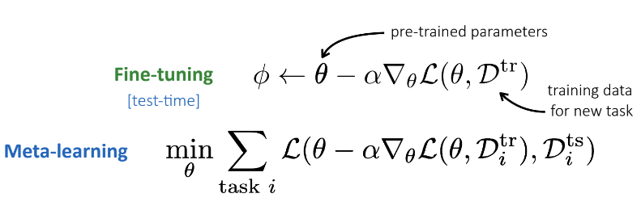  
*Figure 1 - For each task i, MAML computes inner gradient updates on training data-points `D_{tr}^i` and evaluates the loss on test data-points `D_{ts}^i`.  Averaging over all tasks, the outer loop loss function is optimized  w.r.t. the original model parameter `θ` to learn an  initialization that can quickly adapt to new tasks during meta-test time.*

### 1.1 Data Processing  

The data processing functions are implemented as a part of `DataGenerator` class, which `sample_batch` method is used to sample train/validation/test batch. An example of a meta-train and meta-test batch for 5-way 4-shot is shown in figure 2 and figure 3 respectively. Each batch is partitioned into two parts, `input_tr`, `label_tr`, and `input_ts`, `label_ts`,  where `input_tr`, `label_tr` are used to compute gradient updates in the inner loop and `input_ts`, `label_ts` are used to get the task losses after the gradient update.      

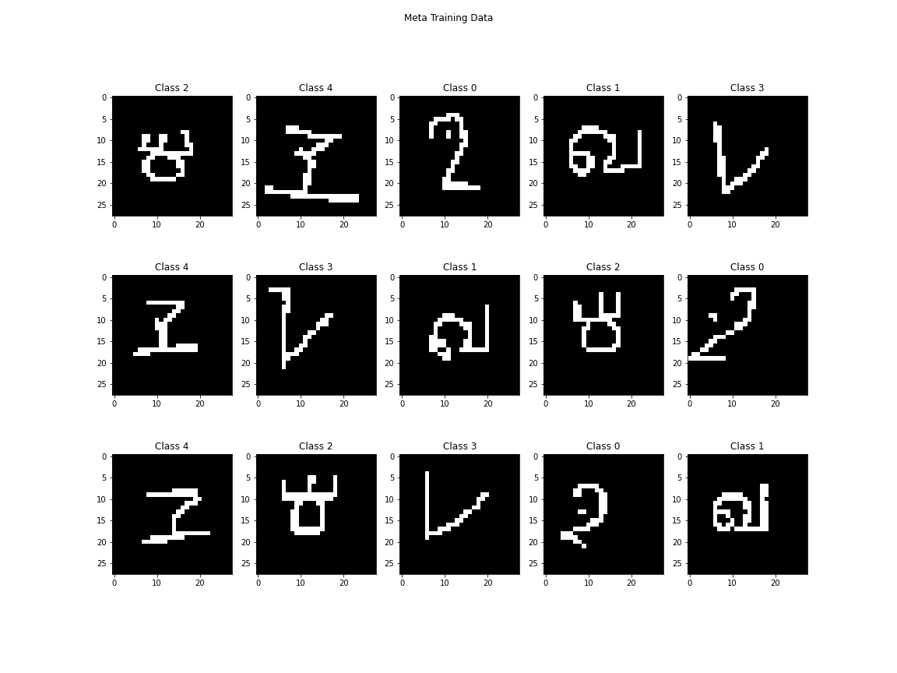  
*Figure 2 - Meta-Training batch sample*  

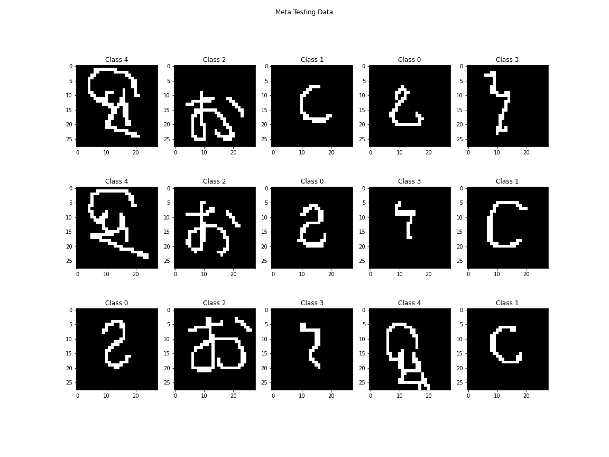  
*Figure 3 - Meta-Test batch sample*  

### 1.2 MAML Task Inner Loop  

`task_inner_loop()` method of `MAML` class implements the inner loop gradient update functionalities for updating the task specific model parameters of MAML. It takes inputs `input_tr`, `label_tr`, `input_ts`, `label_ts` and computes the inner loop updates in the main MAML algorithm. This function computes new `weights` by performing `num_inner_updates` gradient updates and computes test loss on `input_ts` which is later used to update the original model parameters in the outer loop by optimizing for all the tasks.  

### 1.3 MAML 5-way 1-shot  

The MAML model is trained and tested for a 5-way 1-shot problem with a learning rate of `0.4`, `0.04`, and `4.0` and the plot of their training and validation accuracy are shown in figure 4. In the plot shown below: `5way_1shot_lr0.4` -> LR=0.4, `5way_1shot_lr0.4_avg` -> LR=0.4 running average, `5way_1shot_lr0.04` -> LR=0.04, `5way_1shot_lr0.04_avg` -> LR=0.04 running average, `5way_1shot_lr4.0` -> LR=4.0, `5way_1shot_lr4.0_avg` -> LR=4.0 running average. Test losses for those learning rates are summarized in table I.  

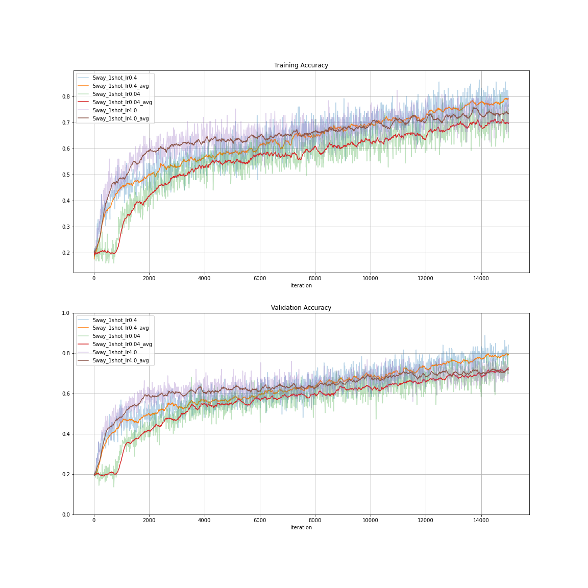  
*Figure 4 - MAML validation loss for learning rate 0.4, 0.04, and 4.0*

*Table I - Test losses for 5-way 1-shot with different learning rates*  

| N-way | K-shot | Learning Rate | Test Accuracy |
|-------|--------|---------------|---------------|
| 5     | 1      | 0.4           | 0.7856667     |
| 5     | 1      | 0.04          | 0.7056667     |
| 5     | 1      | 4.0           | 0.707         |   

As seen in the table above, the network performs best with an inner learning rate of `0.4`. MAML networks are very sensitive to learning rates, and it is because: (1) with a higher learning rate the gradients for each inner task could vary a lot in their directions and the outer loop will not be able to find a common gradient direction which minimizes test loss for all the task test losses; (2) with a lower learning rate the network ends up underfitting and is not able to appropriately model the variations in different task domains.  

### 1.4 Learning the learning rate  

Tuning inner update learning rate can be tricky. A variant of MAML[4] proposes to automatically learn the inner update learning rate. Here we learn separate `inner_update_lr` per `num_inner_update` per weight variable. This improves model performance by quite a bit and it is observed that starting from a very small initial learning rate gives the best result. Plot of training and validation accuracy for different learning rate initialization points are shown below. In all these plots, `learn_lr` postfix specifies the plot with a learnable learning rate.   

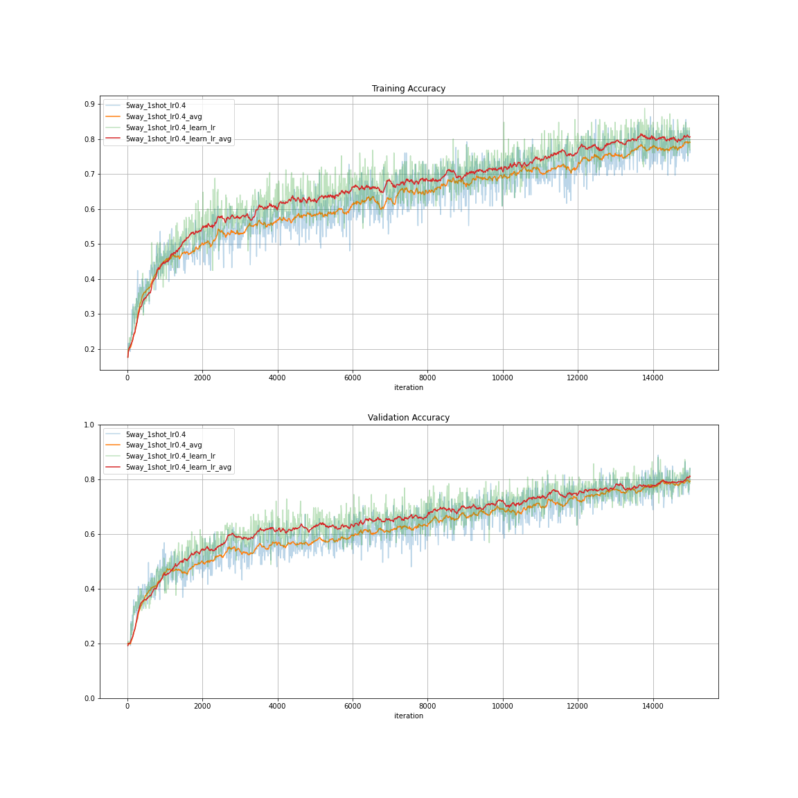  
*Figure 5 - Comparision of training and validation accuracy with and without learnable learning rate for initial learning rate = 0.4*  

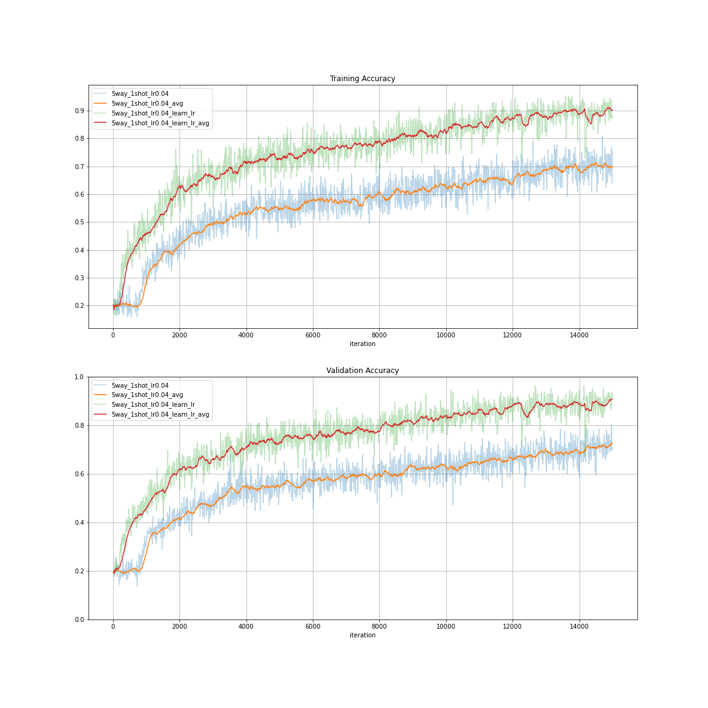  
*Figure 6 - Comparision of training and validation accuracy with and without learnable learning rate for initial learning rate = 0.04*

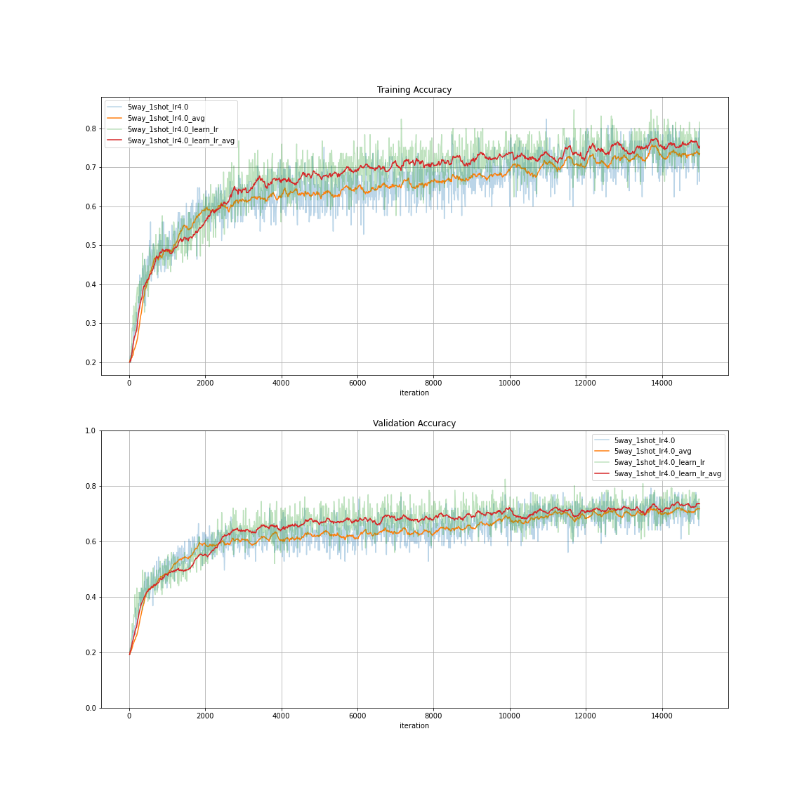  
*Figure 7 - Comparision of training and validation accuracy with and without learnable learning rate for initial learning rate = 4.0*

Comparing the three plots against each other in figure 8, we find that the model with initial learning rate of `0.04` seems to outperform the other two. In contrast, for fixed learning rate, this model did the worst as shown in Table I.  

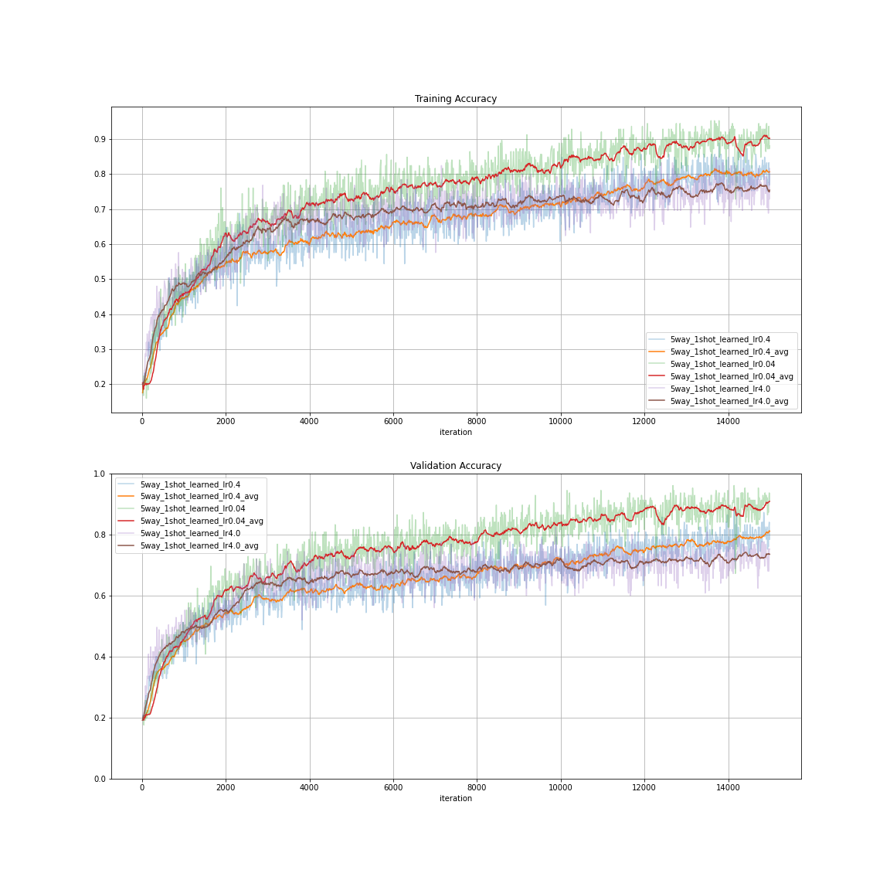  
*Figure 8 - Comparision of training and validation accuracy with learnable learning rate for initial learning rate = `0.4`, `0.04`, and `4.0`*  

## Problem 2: Prototypical Networks [2]  

Now we will try a non-parametric meta-learning algorithm, prototypical networks.  The basic idea of prototypical networks resembles nearest neighbors to class prototypes.  It computes the prototype of each class using a set of support examples andthen calculates the distance between the query example and each the prototypes.  The query example is classified based on the label of the prototype it’s closest to. See Figure 9 for an overview.  

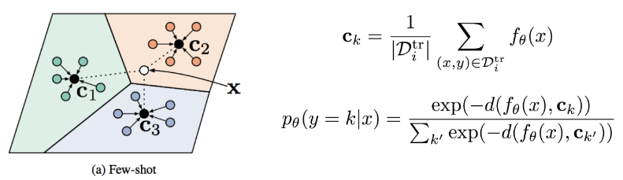  
*Figure 9 - Prototypical networks compute the prototypes of all tasks using training data-points `D{tr}^i`.  Then by comparing the query examplexto each of the prototype, the model makes prediction based on the softmax function over the distance between the embedding of thequery and all prototypes.*  

### 2.1 Data Processing  

The data processing functions are implemented as a part of `DataGenerator` class, which `sample_batch` method is used to sample train/validation/test batch. This batch is then partitioned into `support`, i.e.  the per-task training data, and `query`, i.e.  the per-task test data-points.   The `support` will  be  used to calculate the prototype  of each class  and `query` will be used to compute the distance to each prototype. The labels of the `query` examples are also obtained in order to compute the cross-entropy loss for training the whole model. An example of these support and query sets are shown in figure 10 and 11.       

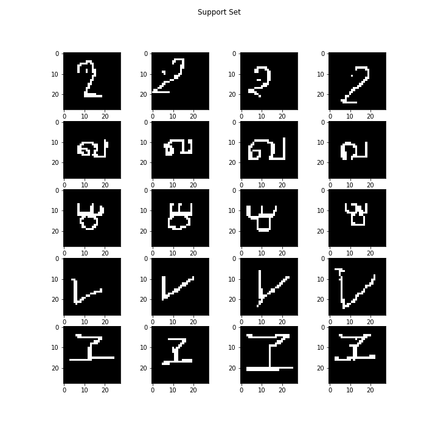  
*Figure 10 - Support set for `n_classes=5` and `k_shot=4`*  

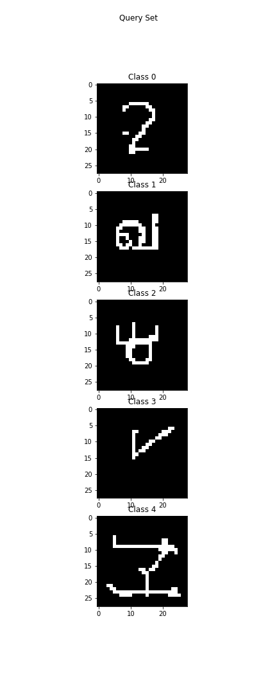  
*Figure 11 - Query set for `n_classes=5` and `k_shot=1`*  

### 2.2 ProtoNet prototypes, distance, and cross-entropy loss  

Prototypes are obtained from the support sets by first (1) getting an embedding of the input images, which is a 16-dimensional latent vector, and then (2) computing a mean of latet vector in each dimension per class. These prototypes are then used to compute distance (L2) between each data-point in query set and each prototype. This distance ranges from \[0, infinity), so we use negative distance as logits to compute a cross-entropy loss with the one-hot labels. The prototypical network is further trained to minimize this loss.  

### 2.3 Training the Prototypical Networks  

This network was trained with the following parameters for 20 epochs where each epoch was composed of 100 episodes: `n_meta_train_way=5, k_meta_train_shot=1, n_meta_train_query=5, n_meta_test_way=5, k_meta_test_shot=4, n_meta_test_query=4`. A plot of its training and validation loss as well as accuracy is shown in figure 12.  

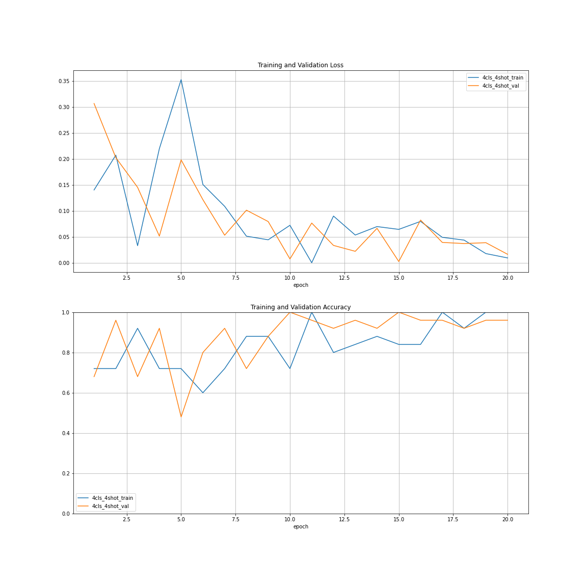   
*Figure 12 - Prototypical networks training/validation loss and accuracy*

Test accuracy and accuracy standard deviation obtained during meta-testing are: `Average Meta-Test Accuracy: 0.96085, Meta-Test Accuracy Std: 0.04985`  

## Problem 3: Comparison and Analysis  

After implementing both meta-learning algorithms, we would like to compare them. Inpractice, we usually have limited amount of meta-training data but relatively more meta-test datapoints. Hence one interesting comparison would be meta-training both algorithms with 5-way 1-shot regime but meta-testing them using 4-shot, 6-shot, 8-shot, and 10-shot data. Average accuracy and accuracy standard deviation are reported in table II.  

*Table II - Avg. accuracy and accuracy standard deviation for MAML and Prototypical Networks*  

| N-way | meta-train K-shot | meta-test K-shot | MAML Accuracy | MAML Accuracy StdDev | ProtoNet Accuracy | ProtoNet StdDev |
|-------|-------------------|------------------|---------------|----------------------|-------------------|-----------------|
| 5     | 1                 | 4                | 0.85658336    | 0.1132953            | 0.96085           | 0.04985         |
| 5     | 1                 | 6                | 0.8611667     | 0.107312836          | 0.96615           | 0.04660         |
| 5     | 1                 | 8                | 0.8699583     | 0.1000656            | 0.97165           | 0.04443         |
| 5     | 1                 | 10               | 0.8720333     | 0.09943775           | 0.97785           | 0.03545         |  

The data from above table are also plotted below, which visualizes the data more intuitively. Ellipses shown in the plot corresponds to the standard deviation for each test-point. As evident from the plot as well as table II, accuracy improves as `K` for the `K-shot` problem in meta-testing data increases. By comparision, Prototypical networks shows significantly high accuracy over MAML.    

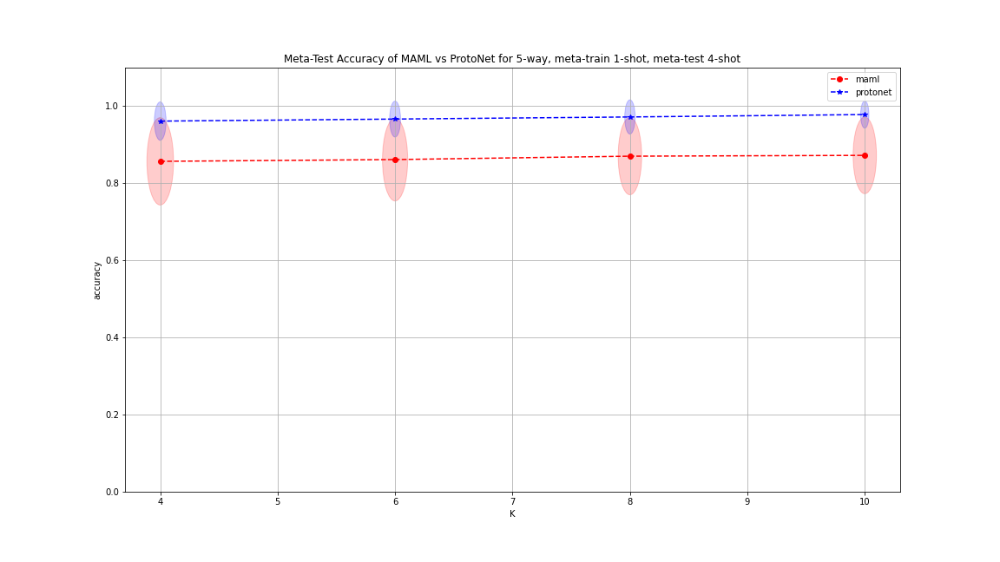  
*Figure 13 - Comparision of averate test accuracy and accuracy standard deviation between MAML and Prototypical Networks*

## References  

[1]  Chelsea Finn, Pieter Abbeel, and Sergey Levine.  Model-agnostic meta-learning for fastadaptation  of  deep  networks.   InProceedings  of  the  34th  International  Conference  onMachine Learning-Volume 70, pages 1126–1135. JMLR. org, 2017.  
[2]  Jake Snell, Kevin Swersky, and Richard Zemel. Prototypical networks for few-shot learn-ing.  InAdvances in Neural Information Processing Systems, pages 4077–4087, 2017.  
[3]  Brenden M. Lake, Ruslan Salakhutdinov, and Joshua B. Tenenbaum.  Human-level con-cept  learning  through  probabilistic  program  induction.Science,  350(6266):1332–1338,2015.  
[4]  Antreas Antoniou, Harrison Edwards, and Amos Storkey. How to train your maml.arXivpreprint arXiv:1810.09502, 2018.