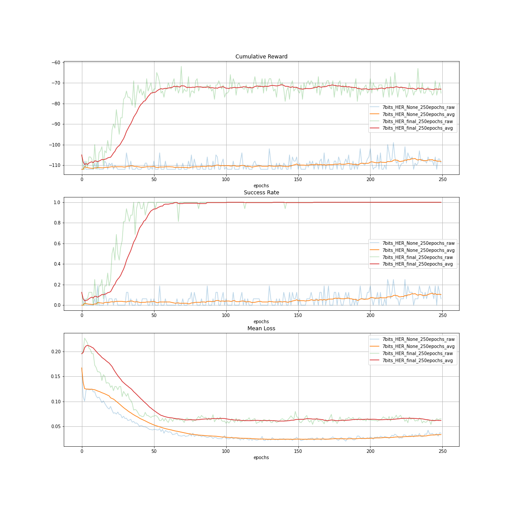

# CS330 Autumn 2020 Homework 3: Goal Conditioned Reinforcement Learning and Hindsight Experience Replay

 - SUNetID: shubhams  
 - Name: Shubham Shrivastava  
 - Collaborators: None  
 - Google Colab: https://colab.research.google.com/drive/1k7uR9pgAsa9o0VD71XU5mydzhMd4U4B7?usp=sharing

# Problem 1:  Implementing Goal-Conditioned RL on BitFlipping

## 1.a  

  
*Figure 1 - Plot of cumulative reward, success rate, and mean loss in the BitFlipping environment without goal conditioning*  

## 1.b  

  
*Figure 1 - Plot of cumulative reward, success rate, and mean loss in the BitFlipping environment with goal conditioning*  

# Problem 2:  Adding Hindsight Experience Replay (HER) to Bit Flipping  

With HER, the model is trained on the actual (state, goal, reward) tuples along with (state,goal, reward) tuples where the goal has been relabeled. The goals are relabeled to be whatstate wasactually reachedand the rewards correspondingly relabeled. In other words, wepretend that the state we reached was always  our  goal. HER gives us more examples of actions that lead to positive rewards. The reward function for relabeled goals is the sameas the environment reward function; for the bit flipping environment, the reward is -1 if thestate and goal vector do not match and 0 if they do match.  

  
*Figure 2 - Illustration of HER. The goals and rewards are relabeled so that we have morepositive rewards to learn from.  In practice, these steps are performed iteratively, returning to step 1 after step 5.*  

There are three different variations of HER:final,random, andfuture.  In each variation,the goal is relabeled differently:  
 - final:  The final state of the episode is used as the goal.  
 - random:  A random state in the episode is used as the goal.  
 - future:  A random future state of the episode is used as the goal.  

Implementation of the three variations of HER is given in the function: `update_replay_buffer()`.  

# Problem 3:  Bit Flipping Analysis  

## 3.a   

  
*Figure 3 - 7-bits, 250-epochs, HER='None' vs. HER='final'*  

The plot above compares performance of no **HER** with **HER final** for the 7-bits 250-epoch case. It can be clearly seen that **HER final** improves performance of DQN agent very significantly and reaches a success rate of 100% in about 70 epochs.  

## 3.b   

  
*Figure 4 - 15-bits, 500-epochs, HER='None' vs. HER='final'*  

The plot above compares performance of no **HER** with **HER final** for the 15-bits 500-epoch case. It can be clearly seen that **HER final** improves performance of DQN agent very significantly and reaches a success rate of 80% in about 200 epochs.  

## 3.c   

  
*Figure 5 - 25-bits, 1000-epochs, HER='None' vs. HER='final'*  

The plot above compares performance of no **HER** with **HER final** for the 25-bits 1000-epoch case. It can be clearly seen that **HER final** improves performance of DQN agent very significantly and reaches a success rate of 60% in about 700 epochs.  

## 3.d   

  
*Figure 6 - 15-bits, 500-epochs, HER='None' vs. HER='final' vs. HER='future' vs. HER='random'*  

The plot above compares performance of no **HER** with **HER final**, **HER future**, and **HER random** for the 15-bits 200-epoch case.   

## 3.e Analysis  

In contrast, it is evident from figure 6 that hindsight experience replay (HER) helps RL algorithms with sparse rewards tremendously. If an agent gets a success reward only after successfully completing the goal, there will not be enough positive experiences to learn from. HER helps these situations by pretending that a state reached within the current episode was intended and prescribed goal. The three versions of `HER` namely `final`, `future`, and `random` improves the performance by quite a bit and have more or less similar effect, although it can be seen in figure 6 that the `future` version of `HER` provides slightly higher success rate.  

# Problem 4:  Implementing Goal-Conditioning and HER on Sawyer Reach  

The Sawyer Arm is a multi-jointed robotic arm for grasping and reaching (https://robots.ieee.org/robots/sawyer/). The arm operates in a 2D space, and the goal is to move therobot to a set of coordinates. The reward function for the Sawyer environment is the negative Euclidean distancebetween the goal and state vector.   

HER was implemented in Sawyer Reach environment in a similar way as earlier.  

# Problem 5:  Sawyer Analysis  

  
*Figure 7 - Sawyer Arm, 150-epochs, HER='None' vs. HER='final'*  

HER is particularly useful for training RL algorithms in an environment with sparse rewards. In an environment where the reward is a function of how close you are to the goal such as the Sawyer Arm environment, HER does not seem to be as effective. This is because you get a feedback from the environment at every time-step as opposed to only during a successful episode termination.

# References  

[1]  Marcin  Andrychowicz,  Filip  Wolski,  Alex  Ray,  Jonas  Schneider,  Rachel  Fong,  PeterWelinder,  Bob McGrew,  Josh Tobin,  Pieter Abbeel,  Wojciech  Zaremba.  Hindsight  Expe-rience Replay.  Neural Information Processing Systems (NeurIPS), 2017.https://arxiv.org/abs/1707.01495  
[2] Leslie Kaelbling.  Learning to Achieve Goals.  International Joint Conferences on ArtificialIntelligence  (IJCAI),  1993.http://citeseerx.ist.psu.edu/viewdoc/summary?doi=10.1.1.51.3077