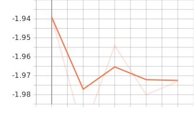
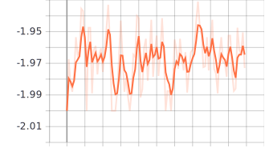
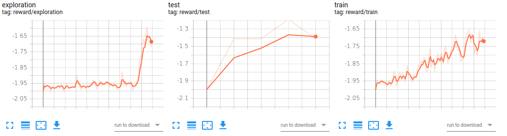
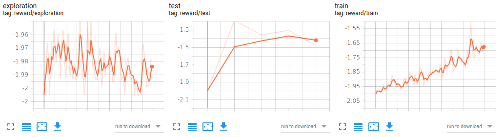

# CS 330 Autumn 2020/2021 Homework 4 - Exploration in Meta-Reinforcement Learning  
 - SUNetID: shubhams  
 - Name: Shubham Shrivastava  
 - Collaborators: None  
 - Google Colab: https://colab.research.google.com/drive/1ZA9VvqkOJjGlkBNYwzE_WTqkiYhdeF8r?usp=sharing

# Problem 1:  Evaluating End-to-End Meta-RL
## 1.1 

  
*Figure 1 - test*  

  
*Figure 2 - train*  

## 1.2  

Without any parameter updates, agent is not able to learn anything. This means that a random agent will not be able to accumulate much rewards. As observed from the plots above, it is precisely the case. The rewards collected during train and test sessions are very low and does not increase over steps.    

# Problem 2:  Implementing Components of DREAM  

Code were implemented for problems 2.1 and 2.2 as instructed.  

# Problem 3:  Analysis of DREAM  
## 3.1  

  
*Figure 3 - Train and Test reward for DREAM (10000 episodes)*  

It is clearly evident that the RL policy improves over time and agent is able to collect more rewards as it progresses.  

## 3.2  

A random exploration policy would result in good exploration and rewards at first but then slowly stop gaining more rewards. In contrast, optimization of exploration policy separately would learn "where to look" and thus improving the performance gradually. We can see that it is actually the case by comparing Figure 3 and Figure 4.  

    
*Figure 4 - Train and Test reward for DREAM - random exploration (10000 episodes)*  